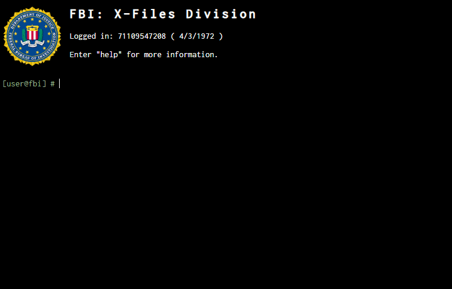
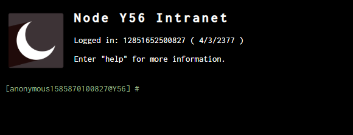
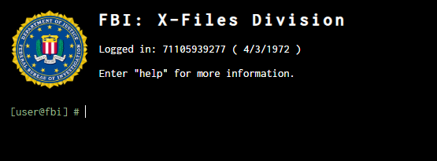
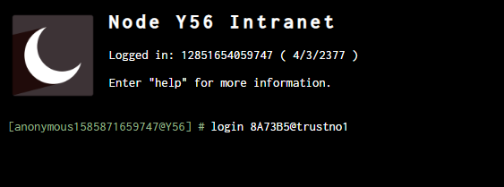
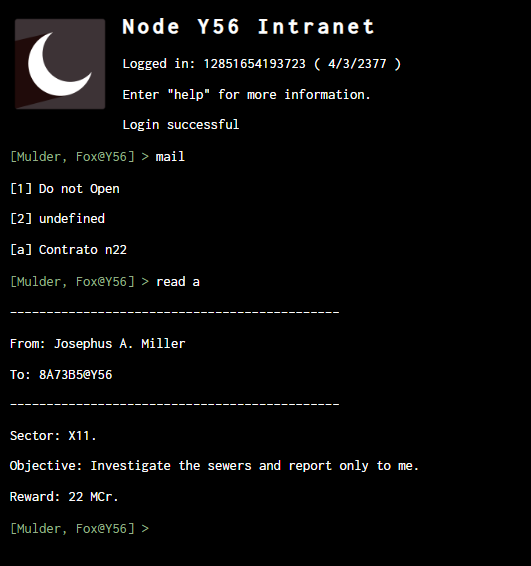
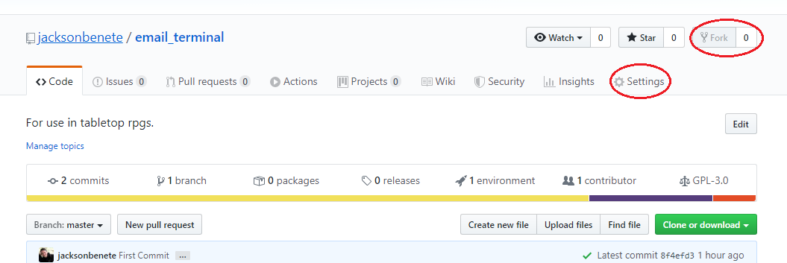
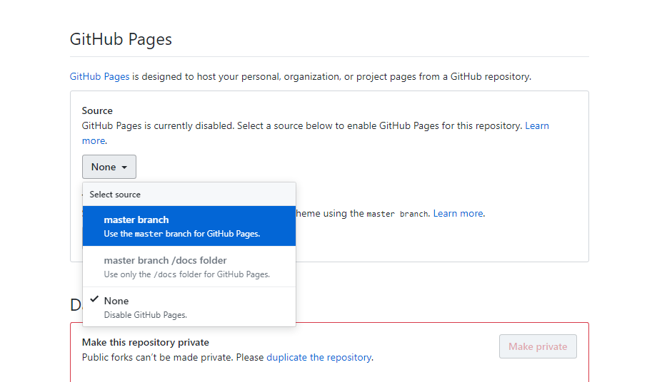

# Email Reader Terminal for tabletop RPGs



This is a simple, read-only, terminal experience for tabletop RPGs.
You can fork the project and change the code for your own configurations, like terminal name (or sector/station/node if sci-fi), image and messages.

The database is a simple JSON structured file.

You can host it on github pages for a free and fast experience and can share the link for your friends and players to use.

## First Considerations

The code may be a mess. 

That's because I may be supposedly improving it.

## How to Configure

You can upload it to Github Pages or try it on your computer. 
You will find instructions for both options below.

### Customization

The basic configuration is what you need to change for customize your terminal.
You can change the terminal year date, the server name, a customized icon, the terminal identification (this is what is written just before of the mouse cursor), as well as the default user name (normally will be "user", but can be whatever you want) and if you want a random number to be displayed right in front of the default username. Note however that once you login to the server the username will change.

You will want to customize the terminal depending of the game setting you're playing. You just have to edit the `conf.json` file. Both `conf.json` and `database.db` customization files are in the config folder.

```json
{
    "year": "2377",
    "serverName": "Node Y56 Intranet",
    "iconName": "Moon-icon.png",
    "terminalID": "Y56",
    "defaultUser": "anonymous",
    "randomSeed": true
}
```
---


```json
{
    "year": "1972",
    "serverName": "FBI: X-Files Division",
    "iconName": "fbi.png",
    "terminalID": "fbi",
    "defaultUser": "user",
    "randomSeed": false
}
```
---


### Login, Mail & Read Functions

The main functions (at least right now) is the `mail` and `read` terminal operations.

Once you `login`, you can write down the `mail` function to list the user emails and you can `read` those mails you want by entering the index code (a number, a letter, or a string). 

As a simple terminal emulation, you can't delete mails or mark as read. We maybe can work it out in the future, but those basic functions are enough to send some cool mysterious mails to your player's agents or if a character hacked into a company to investigate a clue or something.

The `database.db` file (it's just a .txt json file), is where you will perform most editions at.
The basic structure of the file (and the emails) is as follows:

key -> id, password, user, mail.
- id: is the username identificantion for login
- password: is the password necessary to login
- username: this is the name of the player character (if the terminal is where he check his emails) or the name of a npc (if he's hacking into someone else's terminal)
- mail: a array containing the following (key -> from, title, body)
- - from: who send the message
- - title: what you will see when listing the messages at terminal
- - body: the actual message. You can break line by entering a double space '  '.

The first key in the root doesn't matter since you'll be using the `id` field for the username (in the example bellow I've user a simple "1" for the first character), so if you want you can name it as the character name or the player name, but the key in the mail will be used to access the correct message with the `read` command function.

If you're using Traveller, I suggest you to name the id as the UPP of the character/NPC (as I did in the example), but any string will work.

You can register as many users and mail messages as you want, you just need to put a comma `,` right after the correct enclosing `}`. If you're in trouble you can check a basic JSON tutorial, it's easy.

```json
{
    "1": {
        "id": "8A73B5",
        "password": "trustno1",
        "user": "Mulder, Fox",
        "mail": {
            "1": {
                "from": "Traveller",
                "title": "Do not Open",
                "body": "Lorem ipsum dolor sit amet, consectetur adipiscing elit, sed do eiusmod tempor incididunt ut labore et dolore magna aliqua.  Ut enim ad minim veniam, quis nostrud exercitation ullamco laboris nisi ut aliquip ex ea commodo consequat."
            },
            "2": {
                "from": "Software",
                "title": "undefined",
                "body": "001100101 011000101 0110 10 01001 01 01110 1001010101"
            },
            "a": {
                "from": "Josephus A. Miller",
                "title": "Contrato n22",
                "body": "Sector: X11.  Objective: Investigate the sewers and report only to me.  Reward: 22 MCr."
            }
        }
    }
}
```
---

To login you need to enter user@password


---

Note the change in the terminal username


---

How to list and read mails



### Other Functions

You can try `help` to see a list of other functions disponible. The `clear` function may be a good one.

## How to Install

As I've said, you can use Github Pages to do that for you.
If you're not used to Github, first create a github user by registering in [Github](github.com), so you can "fork" the project to your account by accessing the project page [email_terminal](github.com/jacksonbenete/email_terminal) and by clicking in the "fork" button.



Note that those two in red are the only two steps you need to take to put your terminal up and running. You need to click the Fork button, and after some seconds, the project will be there as one of your own repositories, and then you will click in the Settings button.

In the settings page, you will roll until Github Pages and will select the source as the master branch. 



After some seconds, you will be able to access your terminal at username.github.io/email_terminal (i.e. jacksonbenete.github.io/email_terminal).

Note that, you can create multiple repositories and name those repositories in the Settings for each of your game tables, that way you can have one terminal ready for each setting (or for each organization your players will hack into), ex: 
- username.github.io/spacestationX22
- username.github.io/PenTexCorp
- etc

You just need to share the correct link with your players and wait for them to read the clues and investigate.

### How to Configure for localhost

If you're testing this on your computer you'll need to install a http-server because isn't possible to open files for security reasons, and you need that for the ajax to work to access the database file. It will work without problems once it is forked and running as a github page.

```node
npm install http-server -g
```

Run it as `http-server C:\location\to\app` or just `http-server` if you're inside the directory. You can access it on `127.0.0.1:8080` in your browser. If you're debbuging it consider to go to "Network" in the Inspector and disable the cache.

## Future of the Project

That's really a simple terminal emulation, as I've said.
But, there is some things that could be also good to explore, like the creation of some local files or executable programs for the players to interact with.

If you want to, drop some ideas into my github repository or send me some messages at reddit u/jacksonbenete and we can work out something else.

## Acknowledgement
- Base code inspired by @AndrewBarfield, https://codepen.io/AndrewBarfield HTML5 Web Terminal.
- Moon icon by: http://www.iconarchive.com/show/christmas-shadow-2-icons-by-pelfusion/Moon-icon.html and www.pelfusion.com
- Tech icon by: https://favpng.com/png_user/GreatCthulhu
- CMD icon by: https://www.flaticon.com/br/packs/seo-and-web-5
- Vision icon by: https://www.flaticon.com/free-icon/company-vision_1465429
- (non-free) DNA icon by: https://www.iconfinder.com/icons/378473/dna_icon 